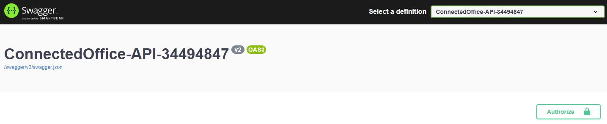
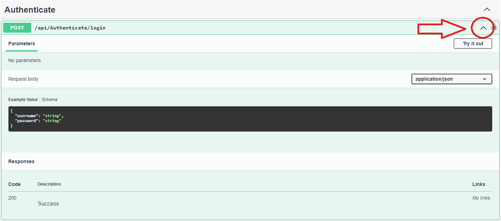
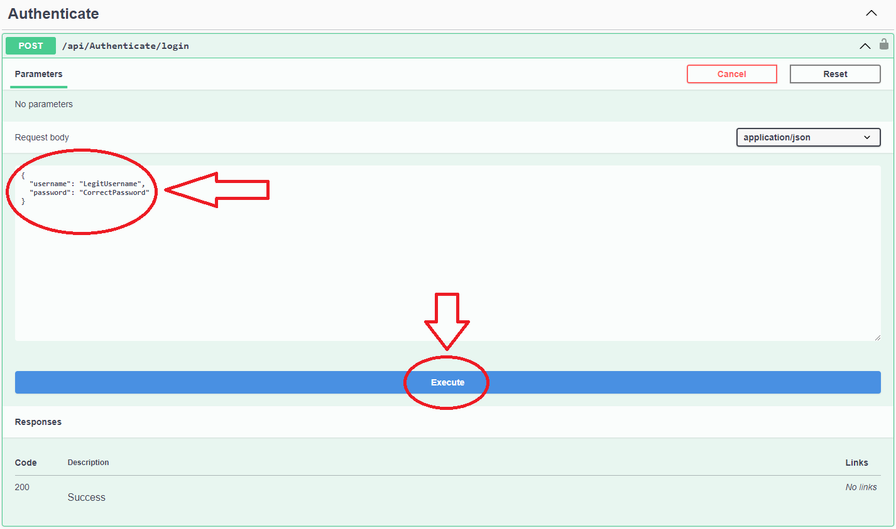
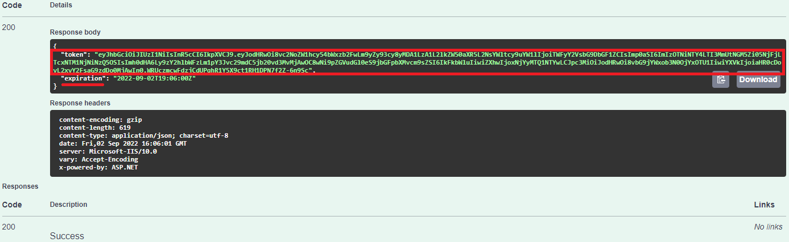
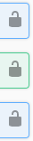
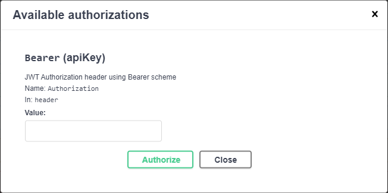
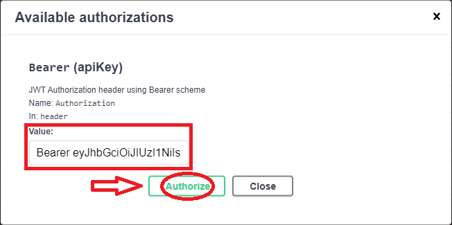
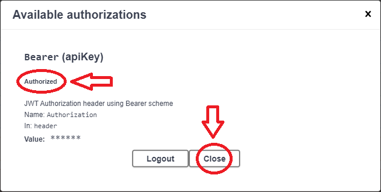
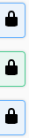

<h2>How to use the API</h2>

	In order to use the API of student 34494847 the user needs to click this link: <a href="https://api-34494847.azurewebsites.net/swagger/index.html">API-34494847</a>.
	Once the web page has landed, the user will be greeted with the following banner:  
	  
	The user needs to login with a username and password to be able to use any of the endpoints. The login credentials are not provided in this README file but are provided in the submission form.
	To login to use the endpoints, the user needs to click on the drop down of the /api.Authenticate/login endpoint:  
	  
	Then the user needs to click the "Try it out button" on the right then enter a valid username and password then click the "Execute" button  
	  
	If the information is correct, the user will receive a JWT token that is 1 hour valid for use to access the endpoints, and then copy this token to your clipboard:  
	  
	Now that we have a valid token for 1 hour, we need to unlock our endpoints. To do so, click on any of the grey unlocked locks to the right:  
	  
	After doing so, the following window will pop up:  
	  
	Now we use the token we have copied to our clipboard earlier, in the value field type "Bearer" followed with a space and then paste the provided token then click the "Authorize" button.  
	  
	Then a new message prompt will show that the user is Authorized, after seeing this message press the close button 
	  
	Now the user will also notice how the locks changes on the right 
	  
	And that is it! The user can now access all of the endpoints in the API of student 34494847.

