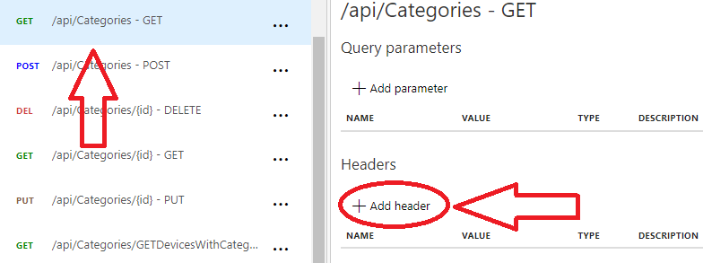
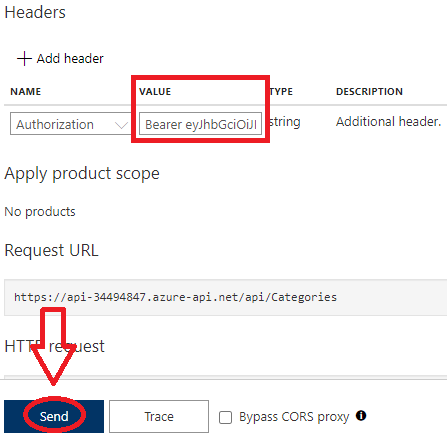
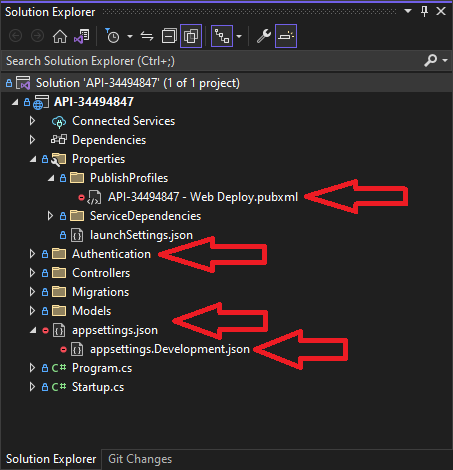

Note: No snippets of imporant code will be provided because I am concered about plagiarism 
<h2>How to use the API</h2>

	Note: To use the API in API Management service, please refer to after this section  
	In order to use the API of student 34494847 the user needs to click this link: <a href="https://api-34494847.azurewebsites.net/swagger/index.html">API-34494847</a>.
	Once the web page has landed, the user will be greeted with the following banner:  
	  
	The user needs to login with a username and password to be able to use any of the endpoints. The login credentials are not provided in this README file but are provided in the submission form.
	To login to use the endpoints, the user needs to click on the drop down of the /api/Authenticate/login endpoint:  
	  
	Then the user needs to click the "Try it out button" on the right, enter a valid username and password then click the "Execute" button:  
	  
	If the information is correct, the user will receive a token that is valid for 1 hour to use to access the endpoints, then copy this token to your clipboard:  
	  
	Now that you have a valid token for 1 hour, you need to unlock the endpoints. To do so, click on any of the grey unlocked locks to the right:  
	  
	After doing so, the following window will pop up:  
	  
	Now use the token you have copied to your clipboard earlier. In the value field type "Bearer" followed with a space and then paste the provided token then click the "Authorize" button:  
	  
	Then a new message prompt will show that the user is Authorized, after seeing this message press the "Close" button:  
	  
	Now the user will also notice how the locks changes on the right as follows:  
	  
	And that's it, the user can now access all of the endpoints in the API of student 34494847 
	<h3>API Management service</h3>
	In order to use the API of student 34494847 in API Management service, the student will grant access for the users to the resource group as discussed at Hosting further down in the README 
	 Once the user is at the API Management service, click the "APIs" option on the left panel: 
	  
	 Now select the "ConnectedOffice-API-34494847" API under the "All APIs" panel and then click "Test" on the right panel: 
	  
	The user needs to login with a username and password to be able to use any of the endpoints. The login credentials are not provided in this README file but are provided in the submission form.
	To login to use the endpoints, the user needs to click on /api/Authenticate/login - POST endpoint:  
	  
	 Then the user needs to enter a valid username and password in the Request body then click the "Send" button:  
	  
	 If the information is correct, the user will receive a token that is valid for 1 hour to use to access the endpoints in the HTTP response, then copy this token to your clipboard:  
	  
	Now that you have a valid token for 1 hour, you need to individually unlock the endpoints you want to use. Select any other endpoint and click the "Add header" button:  
	  
	 Click on the drop down for the "NAME" field and select "Authorization":  
	  
	 Now use the token you have copied to your clipboard earlier. In the value field type "Bearer" followed with a space and then paste the provided token then click the "Send" button:  
	  
	 And that's it, the user can now view the HTTP response for the selected endpoint in the API of student 34494847 
	 

<h2>Data Access Layer</h2>

	The Device, Zone and Category tabels in the provided database from Ms Muller have been scaffolded to generate accurate models of the database structure.
	Then dependancy injection was resolved by adding DBContext to the Startup.cs file. Lastly, the database is hosted on Microsoft Azure which the API is connected to using
	the connection string provided by Microsoft Azure.

<h2>Business Logic Layer</h2>

	Each controller in the API contains every CRUD operaton (Create, Read, Update, and Delete). Additionally, all other specifications of methods in the project has also been completed.
	The Categories controller has two additional methods as requested, a method where the user GETs all devices based on a category ID being parsed in and a method where the user GETs the number of 
	zones that are associated to a specific category based on the category ID being parsed in. For the Zones controller, one additional method has also been added as requested, the method
	GETs all devices within a specific zone based on the zone ID being parsed in. Then finally, the last requirement, each controller contains a method that checks if an
	item exists before trying to edit or delete the item.  
	 CategoriesController:  
	  
	DevicesController:  
	  
	ZonesController:  
	  
	Also note, for the additional methods I joined the entitites using lambdas because it is easier to manage for longevity incase I would like to change something. In doing so,
	I can also see both joined entites in my response body to see how they are linked, like this:  
	 

<h2>Security</h2>

	For the implemented security the student has made use of JWT (JSON Web Token) authentication. Which basically means that the user needs a token (admin token in the student's API) to access any of the endpoints in the API
	as discussed previously "How to use the API". The student also has made extensive use of the .gitignore file to hide any type of file that contains credentials and sensitive information.
	This includes files such as appsettings.json, azure publish profiles etc:  
	  
	Deployment of authorization in each controller (admin users only):  
	 CategoriesController:  
	  
	DevicesController:  
	  
	ZonesController:  
	 

<h2>Hosting</h2>

	The API and database is hosted on the student's Microsoft Azure account. So, the student's API can be accessed over the internet anywhere in the world by clicking: 
	<a href="https://api-34494847.azurewebsites.net/swagger/index.html">API-34494847</a>. The student also granted access to the provided emails in the submission form to access the student's resource group. 
	 Student 34494847's resource group includes the following:  
	<ul>
        <li>API Management service</li>
		<li>App Service plan</li>
		<li>App Service</li>
		<li>SQL server</li>
		<li>SQL database</li>
    </ul>
	

<h2>API Management</h2>

	The student has setup API Management in Azure:  
	 

<h2>Scrum Implementation</h2>

	The student has succesfully kept his GitHub board updated throughout Project 2 as the board was setup in Project 1.
	Also, the student's Project 2 repository is linked to his GitHub board and a lot of effort was done to link the exact repositories of each Project that was done and what must be done
	to each task (Repository and Linked Assessment fields). 
	 

<h2>Source Control</h2>

	The student has added Project 2 to his GitHub profile on day 1 and every change that has been decided to commit was comitted.
	The branching strategy that was setup in Project 1 was followed to the T which demonstrated an iterative use of GitHub throughout Project 2
	to succesfully manage version control of the project. The student also did a lot of effort in providing a very well laid out README.md file by explaining everything possible
	to make it easier for the person trying to figure everyting out. Aboslutely no credentials are available in the student's repository anywhere. 
	 Some of the student's first commits was done over 28 days ago and by now probably over a month ago:  
	 

<h2>Reference List</h2>

	The student provided a reference list with over 30 references on the Project 2 repository and the submission form. Only websites that were relevant and actually useful to produce
	this succesful project was referenced. I have found that the <a href="https://stackoverflow.com/">Stack Overflow</a> site was the most useful and Ms Muller was extremely supportive 
	thoughout the project by providing me guidance where I found myself stuck.

